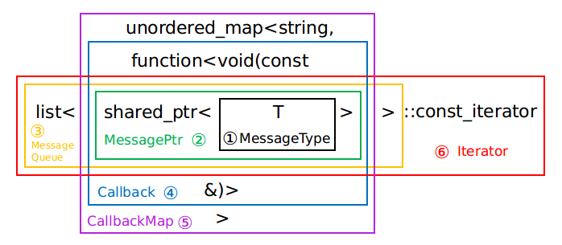

### 29. ` blocker.h`

- 这个代码写得很漂亮，很干净。

#### a) build的红控制

```b
cc_library(
    name = "blocker",
    hdrs = ["blocker.h"],
)
```

#### b) 类BlockerBase

- 一个基类函数，专门用于继承，里边的函数全都是虚函数

#### c) 结构体BlockerAttr

- 维护了两个成员变量：`capacity(size_t)`和`channel_name(string)`,然后就是各种构造方法

#### d) 类Blocker

- 继承自BlockerBase
- 声明友元类BlockerManager，这边只声明可以吗？
- 模板

#### e) using关系图：



- std::unordered_map, 一般会把unordered_map和map比较，map底层是红黑树，unordered_map底层是哈希表。

- 哈希表在查找上更有优势吗？

#### f) 类构造函数Blocker::Blocker()

- 赋值attr_（BlockerAttr），c)介绍的结构体

#### g) 类析构函数Blocker::~Blocker()

- 清除：`observed_msg_queue_`，`published_msg_queue_`，`published_callbacks_`。都是成员变量

#### h) 类函数Blocker::Publish()

- 调用i)

#### i) 类函数Blocker::Publish()

- 调用`Enqueue()`和`Notify()`.
- 所以作用是？

#### j) 类函数Blocker::ClearObserved()

- 线程安全地清除`observed_msg_queue_`

#### k) 类函数Blocker::ClearPublished()

- 线程安全地清除`published_msg_queue_`

#### l) 类函数Blocker::Observe()

- 线程安全地把`observed_msg_queue_`赋值为`published_msg_queue_`

#### m) 类函数Blocker::IsObservedEmpty()

- 线程安全地判断`observed_msg_queue_`是否为空。
- 如果仅是读取的话需要加线程锁吗？难道读取的过程内部还执行了写？

#### n) 类函数Blocker::IsPublishedEmpty()

- 线程安全地判断`published_msg_queue_`是否为空。
- IsPublishedEmpty()和IsObservedEmpty()共用一把锁。线程锁的复用问题。一把锁可以锁不同的资源吗？既然是不同的资源，它们之间有干涉吗？需要锁吗?

#### o) 类函数Blocker::Subscribe()

- published_callbacks_中加入一对键值。

#### p) 类函数Blocker::Unsubscribe()

- published_callbacks_中由键删除值。

#### q) 类函数Blocker::GetLatestObserved()

- 声明是正常写法，定义确实尾置类型，这样可以吗？
- 返回队列`observed_msg_queue_`的首项。

#### s) 类函数Blocker::GetLatestObservedPtr()

- 和q)基本上一样，不过返回的是指针。

#### t) 类函数Blocker::GetOldestObservedPtr()

- 返回队列`observed_msg_queue_`的尾项，指针形式。

#### u) 类函数Blocker::GetLatestPublishedPtr()

- 返回队列`observed_msg_queue_`的首项，指针形式。

#### v) 类函数Blocker::ObservedBegin()

- 返回指向队列`observed_msg_queue_`首项的迭代器。

#### w) 类函数Blocker::ObservedEnd()

- 返回指向队列`observed_msg_queue_`尾项的迭代器。

#### x) 类函数Blocker::capacity()

- 返回attr_.capacity，它是某个值容量上限？

#### y) 类函数Blocker::set_capacity()

- 线程安全地，设置attr_.capacity
- attr_.capacity是published_msg_queue_的容量。
- published_msg_queue长度超出attr_.capacity时，优先删除队尾的量，知道满足attr_.capacity

#### z) 类函数Blocker::Reset()

- 私有
- 线程安全地清除：`observed_msg_queue_`，`published_msg_queue_`，`published_callbacks_`。都是成员变量

#### z1) 类函数Blocker::Enqueue()

- 私有
- `published_msg_queue_`的首部添加值，检查size并尝试清除队尾。

#### z2) 类函数Blocker::Notify()

- 私有
- 对于`published_callbacks_`中的每个元素std::pair<std::string, Callback>，它的second：Callback，也就是std::function<*void*(const MessagePtr&)>，把msg传给它并执行该function。

### 30. ` blocker_mananger.h`&`blocker_mananger.cc`

- 从命名的角度看这个代码是blocker的管理者。
- 维护了一个类：BlockerManager

#### a) build的红控制

```
cc_library(
    name = "blocker_manager",
    srcs = ["blocker_manager.cc"],
    hdrs = ["blocker_manager.h"],
    deps = [
        ":blocker",
    ],
)
```

#### b) 类BlockerManager

#### c) using

- 

#### d)类析构函数：BlockerManager::~BlockerManager()

- 清除`blockers_`
- `blockers_`是成员变量，

#### e) 类函数BlockerManager::Instance()

- 静态函数
- 创建一个`BlockerManager`智能指针，这个智能指针本身也是静态的，所以在一个代码中多次调用Instance()只会创建一个智能指针而非多次创建？

#### f) 类函数BlockerManager::GetOrCreateBlocker()

- 根据`attr.channel_name`查找`blockers_(unordered_map<string, shared_ptr<BlockerBase>>)`,不存在则创建。
- `std::dynamic_pointer_cast`:智能指针的向下转换 https://blog.csdn.net/u010846653/article/details/74535519

#### f1) 类函数BlockerManager::GetBlocker()

- 根据`attr.channel_name`查找`blockers_(unordered_map<string, shared_ptr<BlockerBase>>)`,不存在则返回空指针。

#### g) 类函数BlockerManager::Publish()

- 模板
- 调用了f) 创建或调用了一个`blocker(Blocker<T>)`
- 调用blocker的成员函数Publish()。
- typename

#### h) 类函数BlockerManager::Publish()

- g)的重载。

#### i) 类函数BlockerManager::Subscribe()

- 模板
- 调用了f) 创建或调用了一个`blocker(Blocker<T>)`
- 调用blocker的成员函数Subscribe()。

#### j) 类函数BlockerManager::Unsubscribe()

- 模板
- 调用了f1) 根据channel_name查询blocker
- 调用blocker的成员函数Unsubscribe()。

#### k) 类函数BlockerManager::Observe()

- blockers_中的每一个second(BlockerBase)执行它的Observe()

#### l) 类函数BlockerManager::Reset()

- blockers_中的每一个second(BlockerBase)执行它的Reset()

#### m) 部分私有函数

```
BlockerManager();
BlockerManager(const BlockerManager&) = delete;
BlockerManager& operator=(const BlockerManager&) = delete;
```

这些构造函数以及delete是想只留有Instance()这个函数来创建对象吗？

#### n) 成员变量blockers_

- BlockerMap

#### o) 成员变量blocker_mutex_

- 线程锁