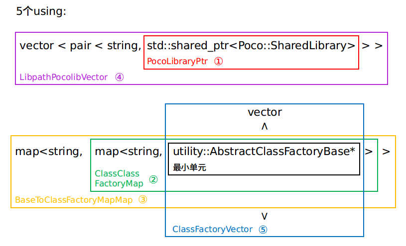

### 24. `utility/class_factory.h & utility/class_factory.cc`

无界限队列。

#### a) `BUILD`的控制：

```cmake
cc_library(
    name = "class_loader",
    srcs = [
        "class_loader.cc",
        "utility/class_factory.cc",
        "utility/class_loader_utility.cc",
    ],
    hdrs = [
        "class_loader.h",
        "class_loader_register_macro.h",
        "utility/class_factory.h",
        "utility/class_loader_utility.h",
    ],
    deps = [
        "//cyber:init",
        "//cyber/common:log",
        "@poco//:PocoFoundation",
    ],
)
```

这个build控制多个文件，文件展开树：


删除重复文件之后的展开树：


这下知道该先看哪个文件了（`class_factory.h`&`class_factory.cc`->`class_loader_utility.h`&`class_loader_utility.cc`->`class_loader_register_macro.h`->`class_loader.h`&`class_loader.cc`）。

这几个文件涉及到头文件相互包含，看了一篇博客https://blog.csdn.net/hazir/article/details/38600419，写的比较好，现复现一下他的工作：(好像看错了，它并没有头文件相互包含，只是有一些头文件重复包含了，不过这里学习下也可以的)

- C++是允许头文件相互包含的先看一个小例子：
  - 代码:

```c++
// header1.h
#ifndef _HEADER_1_H__
#define _HEADER_1_H__
#include"header2.h"
#endif
```

```c++
// header2.h
#ifndef _HEADER_2_H__
#define _HEADER_2_H__
#include"header1.h"
#endif
```

```c++
// source1.cc
#include"header1.h"
int main(int argc, char **argv){
    return 0;
}
```

- 编译：

```shell
g++ source1.cc
```

编译会成功的。

但若没有`#ifndef`，编译会报错：

  - 代码:

```c++
// header1.h
#include"header2.h"
```

```c++
// header2.h
#include"header1.h"
```

```c++
// source1.cc
#include"header1.h"
int main(int argc, char **argv){
    return 0;
}
```

- 编译：

```shell
g++ source1.cc
```

会报错：

```shell
In file included from header2.h:2:0,
                 from header1.h:2,
                 from header2.h:2,
                 from header1.h:2,
                 from header2.h:2,
                 from header1.h:2,
                 ......
                 from header2.h:2,
                 from header1.h:2,
                 from header2.h:2,
                 from header1.h:2,
                 from source1.cc:2:
header1.h:2:20: error: #include nested too deeply
```

所以还是要加上`#ifndef`防止递归无穷包含。

再看一个例子：

```c++
// header1.h
#ifndef _HEADER_1_H__
#define _HEADER_1_H__
#include"header2.h"
#define CONST_FOR_HEADER_2  1 //a macro used in header2.h
bool func(Header2Class* CA){ //defined in header2.h
    return true;
}
#endif
```

```c++
// header2.h
#ifndef _HEADER_2_H__
#define _HEADER_2_H__
#include"header1.h"
class Header2Class{ // used in header1.h
  int mVar;
  void setMem(){ mVar = CONST_FOR_HEADER_2; };   //macro CONST_FOR_HEADER_2 is defined in head1er.h
};
#endif
```

```c++
// source1.cc
#include"header1.h"
int main(int argc, char **argv){
    return 0;
}
```

```c++
// source2.cc
#include"header2.h"
int main(int argc, char **argv){
    return 0;
}
```

编译：

```shell
g++ source1.cc -o app1 & g++ source2.cc -o app2
```

报错：

```shell
[1] 9207
In file included from header2.h:3:0,
                 from source2.cc:2:
header1.h:6:11: error: ‘Header2Class’ was not declared in this scope
 bool func(Header2Class* CA){ //defined in header2.h
           ^
header1.h:6:25: error: ‘CA’ was not declared in this scope
 bool func(Header2Class* CA){ //defined in header2.h
                         ^
header1.h:6:28: error: expected ‘,’ or ‘;’ before ‘{’ token
 bool func(Header2Class* CA){ //defined in header2.h
                            ^
In file included from header1.h:3:0,
                 from source1.cc:1:
header2.h: In member function ‘void Header2Class::setMem()’:
header2.h:7:25: error: ‘CONST_FOR_HEADER_2’ was not declared in this scope
   void setMem(){ mVar = CONST_FOR_HEADER_2 };   //macro CONST_FOR_HEADER_2 is defined in head1er.h
                         ^
In file included from source2.cc:2:0:
header2.h: In member function ‘void Header2Class::setMem()’:
header2.h:7:44: error: expected ‘;’ before ‘}’ token
   void setMem(){ mVar = CONST_FOR_HEADER_2 };   //macro CONST_FOR_HEADER_2 is defined in head1er.h
                                            ^
[1]+  Exit 1                  g++ source1.cc -o app1
```

先分析第一个问题：`error: ‘Header2Class’ was not declared in this scope`报错是`source2.cc`发出的，cc(cpp,c)文件找头文件的话是直接讲头文件包含进来：

```C++
// source2.cc 找头文件后会拼接成一个新的文件
// 拼接后展开来的新文件

// header1.h
#ifndef _HEADER_1_H__
#define _HEADER_1_H__
// #include"header2.h"
#define CONST_FOR_HEADER_2  1 //a macro used in header2.h
bool func(Header2Class* CA){ //defined in header2.h 		<---这里错误看得很清楚，CA在使用前并没有定义，而是在之后定义
    return true;
}
#endif

// header2.h
#ifndef _HEADER_2_H__
#define _HEADER_2_H__
// #include"header1.h"
class Header2Class{ // used in header1.h
  int mVar;
  void setMem(){ mVar = CONST_FOR_HEADER_2; };   //macro CONST_FOR_HEADER_2 is defined in head1er.h
};
#endif

// source2.cc
#include"header2.h"
int main(int argc, char **argv){
    return 0;
}
```

所以要在header1.h之中声明类`Header2Class`。修改之后的文件为：

```c++
// header1.h
#ifndef _HEADER_1_H__
#define _HEADER_1_H__
#include"header2.h"
#define CONST_FOR_HEADER_2  1 //a macro used in header2.h
class Header2Class;		// <-------------这里新增一行
bool func(Header2Class* CA){ //defined in header2.h
    return true;
}
#endif
```

```c++
// header2.h
#ifndef _HEADER_2_H__
#define _HEADER_2_H__
#include"header1.h"
class Header2Class{ // used in header1.h
  int mVar;
  void setMem(){ mVar = CONST_FOR_HEADER_2; };   //macro CONST_FOR_HEADER_2 is defined in head1er.h
};
#endif
```

```c++
// source1.cc
#include"header1.h"
int main(int argc, char **argv){
    return 0;
}
```

```c++
// source2.cc
#include"header2.h"
int main(int argc, char **argv){
    return 0;
}
```

编译:

```shell
g++ source1.cc -o app1 & g++ source2.cc -o app2
```

过程不报错了，但会另一个问题：

```c++
[1] 10617
In file included from header1.h:3:0,
                 from source1.cc:1:
header2.h: In member function ‘void Header2Class::setMem()’:
header2.h:7:25: error: ‘CONST_FOR_HEADER_2’ was not declared in this scope
   void setMem(){ mVar = CONST_FOR_HEADER_2 };   //macro CONST_FOR_HEADER_2 is defined in head1er.h
                         ^
In file included from source2.cc:2:0:
header2.h: In member function ‘void Header2Class::setMem()’:
header2.h:7:44: error: expected ‘;’ before ‘}’ token
   void setMem(){ mVar = CONST_FOR_HEADER_2 };   //macro CONST_FOR_HEADER_2 is defined in head1er.h
                                            ^
[1]+  Exit 1                  g++ source1.cc -o app1
```

分析第二个问题：`error: ‘CONST_FOR_HEADER_2’ was not declared in this scope`报错是`source1.cc`发出的，编译过程中`source1.cc`会展开成：

```c++
// header2.h
#ifndef _HEADER_2_H__
#define _HEADER_2_H__
// #include"header1.h"

class Header2Class{ // used in header1.h
  int mVar;
  void setMem(){ mVar = CONST_FOR_HEADER_2 };   //macro CONST_FOR_HEADER_2 is defined in head1er.h <---错误也很清楚，CONST_FOR_HEADER_2在使用前并没有定义，而是在之后定义
};
#endif

// header1.h
#ifndef _HEADER_1_H__
#define _HEADER_1_H__
// #include"header2.h"
#define CONST_FOR_HEADER_2  1 //a macro used in header2.h
class Header2Class; 
bool func(Header2Class* CA){ //defined in header2.h
    return true;
}
#endif

// source1.cc
#include"header1.h"
int main(int argc, char **argv){
    return 0;
}
```

所以会报错，改动方法是更改宏定义`#define CONST_FOR_HEADER_2  1`的位置，改动之后代码为：

```c++
// header1.h
#ifndef _HEADER_1_H__
#define _HEADER_1_H__
#include"header2.h"
// #define CONST_FOR_HEADER_2  1 //a macro used in header2.h <--------以前在这里
class Header2Class;
bool func(Header2Class* CA){ //defined in header2.h
    return true;
}
#endif
```

```c++
// header2.h
#ifndef _HEADER_2_H__
#define _HEADER_2_H__
#include"header1.h"

// #define CONST_FOR_HEADER_2  1  <--------移动到这儿
class Header2Class{ // used in header1.h
  int mVar;
  void setMem(){ mVar = CONST_FOR_HEADER_2; };   //macro CONST_FOR_HEADER_2 is defined in head1er.h
};
#endif
```

```c++
// source1.cc
#include"header1.h"
int main(int argc, char **argv){
    return 0;
}
```

```c++
// source2.cc
#include"header2.h"
int main(int argc, char **argv){
    return 0;
}
```

可以通过编译！

#### b) 类声明`ClassLoader`：

-  仅仅声明了一个类。

#### c) 类`AbstractClassFactoryBase`

- 很简单的一个类

#### c1) 类成员`AbstractClassFactoryBase::relative_class_loaders_`

- `std::vector<ClassLoader*>`

#### c2) 类成员`AbstractClassFactoryBase::relative_library_path_`

- `std::string`

#### c3) 类成员`AbstractClassFactoryBase::base_class_name_`

- `std::string`

#### c4) 类成员`AbstractClassFactoryBase::class_name_`

- `std::string`

#### d) 类构造函数:`AbstractClassFactoryBase::AbstractClassFactoryBase()`

- 赋值`relative_library_path_` `base_class_name_` `class_name_` `relative_library_path_`赋为空值

#### e) 类析构函数:`AbstractClassFactoryBase::~AbstractClassFactoryBase()`

- 虚函数

#### f) 类函数:`AbstractClassFactoryBase::SetRelativeLibraryPath()`

- 设置相关链接库路径，给`relative_library_path_`赋值

#### g) 类函数:`AbstractClassFactoryBase::AddOwnedClassLoader()`

- 向`relative_class_loaders_`中添加新值，`relative_class_loaders_`是一个类加载器指针(ClassLoader*)的`vector`，`relative_class_loaders_`是一个类成员.

#### h) 类函数:`AbstractClassFactoryBase::RemoveOwnedClassLoader()`

- 在`relative_class_loaders_`删除一个元素，但`relative_class_loaders_`是一个vector，它的删除元素操作是否效率低？或者该方法不会频繁使用？

#### i) 类函数:`AbstractClassFactoryBase::IsOwnedBy()`

- `relative_class_loaders_`是否含有`loader`。

#### j) 类函数:`AbstractClassFactoryBase::IsOwnedByAnybody()`

- 判断`relative_class_loaders_`是否为空。

#### k) 类函数:`AbstractClassFactoryBase::GetRelativeClassLoaders()`

- 返回`relative_class_loaders_`。

#### l) 类函数:`AbstractClassFactoryBase::GetRelativeLibraryPath()`

- 返回`relative_library_path_`。

#### m) 类函数:`AbstractClassFactoryBase::GetBaseClassName()`

- 返回`base_class_name_`。

#### n) 类函数:`AbstractClassFactoryBase::GetClassName()`

- 返回`class_name_`。

#### o) 类:`AbstractClassFactory`

- 继承自`AbstractClassFactoryBase`

#### p) 类构造函数:`AbstractClassFactory::AbstractClassFactory()`

- 集成父类的构造函数。

#### q) 类函数:`AbstractClassFactory::CreateObj()`

- 虚函数。
- `const = 0` `const`和 `=0`，要分开理解，`=0`表示这个成员函数是纯虚函数，也就是它可以没有定义，只有接口，由它的继承类具体定义它的行为，当然，你也可以给它定义缺省的函数体https://www.cnblogs.com/Stephen-Qin/p/10128922.html
- 所以该类只能被继承，而不能创建它的对象。使能创建它的派生类。这里可以自己写一个例子感受下。

#### r) 类函数:`AbstractClassFactory::AbstractClassFactory()`

- 为什么不是public？

#### s) 类函数:`AbstractClassFactory::AbstractClassFactory()`

- 为什么不是public？

- 允许拷贝构造

#### t) 类函数:`AbstractClassFactory::AbstractClassFactory()`

- 为什么不是public？
- 允许拷贝构造

#### u) 类:`ClassFactory`

- 继承自``AbstractClassFactory`

#### v)类构造函数：`ClassFactory::ClassFactory`()

#### w)类函数：`ClassFactory::CreateObj()`

- 

### 25. `class_loader_utility.h`&`class_loader_utility.cc`

- 它的build在24)中已经介绍。
- 用C++写面向过程风格的代码就是这样写的吗?
- 这份代码不好读的原因是用了大量的static+return+&(引用)结构；map里边套map。

#### a) 类声明`ClassLoader`：

-  仅仅声明了一个类。

#### b) `using`：

- 5个using，它们套来套去的，关系如下：

  

#### c) 函数GetClassFactoryMapMap()

- 维护一个`BaseToClassFactoryMapMap`实例

- 函数中大量使用了static+return+&(引用)结构：

 ```
BaseToClassFactoryMapMap& GetClassFactoryMapMap() {
static BaseToClassFactoryMapMap instance;
return instance;
}
 ```
- 它是否相当于：?它是否相当于语法糖？
```
BaseToClassFactoryMapMap instance;
```

#### d) 函数GetClassFactoryMapMapMutex()

- 维护一个`std::recursive_mutex`实例
- `std::recursive_mutex`递归锁，相对于`std::mutex`，`std::recursive_mutex`在锁里边又加了一个计数器。许多文章上说这样可以防止死锁。

```C++
// 该例子使用std::mutex，可能无法在同一线程里重复加锁，会输出：
/*
1.
*/
#include <iostream>       // std::cout
#include <thread>         // std::thread
#include <mutex>          // std::mutex
int counter=0; 
std::mutex mtx; // locks access to counter
void attempt_10k_increases() {
    mtx.lock(); 
    std::cout<<"1. "<<std::endl;
    mtx.lock(); 
    std::cout<<"2. "<<std::endl;
    for (int i=0; i<10000; ++i) {
        ++counter;
    }
    mtx.unlock();
    mtx.unlock();
    std::cout<<"3. "<<std::endl;

}
int main (int argc, const char* argv[]) {
    std::thread threads[1];
    for (int i=0; i<1; ++i)
        threads[i] = std::thread(attempt_10k_increases);
    for (auto& th : threads) th.join();
    return 0;
}
```

```c++
// 该例子使用std::recursive_mutex，允许重复加锁，会输出：
/*
1. 
2. 
3. 
*/
#include <iostream>       // std::cout
#include <thread>         // std::thread
#include <mutex>          // std::mutex
int counter=0; 
std::mutex mtx; // locks access to counter
void attempt_10k_increases() {
    mtx.lock(); 
    std::cout<<"1. "<<std::endl;
    mtx.lock(); 
    std::cout<<"2. "<<std::endl;
    for (int i=0; i<10000; ++i) {
        ++counter;
    }
    mtx.unlock();
    mtx.unlock();
    std::cout<<"3. "<<std::endl;

}
int main (int argc, const char* argv[]) {
    std::thread threads[1];
    for (int i=0; i<1; ++i)
        threads[i] = std::thread(attempt_10k_increases);
    for (auto& th : threads) th.join();
    return 0;
}
```

#### e) 函数GetLibPathPocoShareLibVector()

- 维护一个`LibpathPocolibVector`实例。

#### f) 函数GetLibPathPocoShareLibMutex()

- 维护一个`std::recursive_mutex`实例。

#### g) 函数GetClassFactoryMapByBaseClass()

- 由键查值：`BaseToClassFactoryMapMap`，如果没有，创建一对键值，键它讲的是`typeid_base_class_name(std::string)`

#### g1) 函数GetCurLoadingLibraryNameReference()

- 仅在.cc代码中出现。
- 维护一个`library_name(string)`实例

#### h) 函数GetCurLoadingLibraryName()

- 调用`GetCurLoadingLibraryNameReference`,返回值而非引用.

#### j) 函数SetCurLoadingLibraryName()

- 设置`library_name`,g1)中维护的.

#### j1) 函数GetCurActiveClassLoaderReference()

- 维护一个`ClassLoader*`

#### k) 函数GetCurActiveClassLoader()

- 调用`GetCurActiveClassLoaderReference`,返回值而非引用.

#### l) 函数SetCurActiveClassLoader()

- 调用`ClassLoader`,j1)中维护的.

#### m) 函数IsLibraryLoaded()

- `LibpathPocolibVector`和`ClassFactoryVector`的交汇。
- 如果`LibpathPocolibVector`有但`ClassFactoryVector`没有，返回true。
- 这个代码好复杂，虽然每行代码都看得懂，但放在一起不知道他要干什么。
- 

#### n) 函数IsLibraryLoadedByAnybody()

- 线程安全地:判断`LibPathPocoShareLibVector`中是否存在键`library_path`,`LibPathPocoShareLibVector`在e)中维护

#### o) 函数LoadLibrary()

- 如果放入到`LibpathPocolibVector`意味着类已经被加载了吗？
- `Poco::SharedLibrary a_shared_library(library_path)` Poco::SharedLibrary的用法吗？
- 创建一个`std::pair<std::string, PocoLibraryPtr>(*library_path*, new Poco::SharedLibrary(*library_path*))`，并加入到`LibpathPocolibVector`中去

#### p) 函数UnloadLibrary()

- 删除`LibpathPocolibVector`中的元素。

#### r) 函数RegisterClass()

- ` utility::AbstractClassFactory<Base>* new_class_factory_obj =new utility::ClassFactory<Derived, Base>(*class_name*, *base_class_name*);`用一个基类指针指向一个派生类对象. 可以调用派生类的资源.

- new_class_factory_obj的relative_class_loaders_(std::vector<ClassLoader*>)中添加一个值，使用该函数前必须调用`GetCurActiveClassLoader()`
- new_class_factory_obj的relative_library_path_设置新值,  使用该函数前必须调用`GetCurLoadingLibraryName()`
- 线程安全地: 
- `typeid` 类型名，编译期确定。
- 在一个ClassFactoryMap中新建一对键值，其中键是基类的名字(typeid(Base).name()),值通过`factory_map[class_name] = new_class_factory_obj;`赋值，也就是一个基类指针. 
- 总体上：RegisterClass<Derived, Base>() 会给GetClassFactoryMapMap()中的静态变量instance(BaseToClassFactoryMapMap)：插入一对键值对，键是基类的类型名称`typeid(Base).name(),`值的类型是ClassClassFactoryMap()(std::map<std::string, utility::AbstractClassFactoryBase*>)所以值也是键值对map，并针对值新建一对键值对：把派生类的名称-基类指针（指向一个派生类对象）（factory_map[*class_name*] = new_class_factory_obj;）
- 注意它是两层键值对map：`std::map<std::string,std::map<std::string, utility::AbstractClassFactoryBase*>>`

#### s) 函数CreateClassObj()

- 线程安全地: 对map：`std::map<std::string,std::map<std::string, utility::AbstractClassFactoryBase*>>`查`map[typeid(Base).name()][*class_name*]`,若存在值，它的类型是`utility::AbstractClassFactoryBase*`，类型转换为`utility::AbstractClassFactory<Base>*`并赋给`factory`
  - 如果有值`factory`且`factor`	的`relative_class_loaders_`中有`loader`创建一个新的派生类，并返回该派生类。

#### t) 函数GetValidClassNames()

- 线程安全地：查找一个拥有loader的factory
- 遍历地获取某个名字

#### u) 函数GetAllClassFactoryObjectsOfLibrary() 

- 仅在.cc代码中出现。

- 对 w)GetAllClassFactoryObjects() 再过滤一遍，满足`(utility::AbstractClassFactoryBase*)->GetRelativeLibraryPath() == library_path`的。

#### v) 函数GetAllClassFactoryObjects() 

- 仅在.cc代码中出现。
- 格式转换，本来是：`std::map<std::string, utility::AbstractClassFactoryBase*>`,转成`std::vector<utility::AbstractClassFactoryBase*>`
- 没有用到全局变量

#### w) 函数GetAllClassFactoryObjects() 

- 仅在.cc代码中出现。
- v)的重载
- 线程安全地：把一个BaseToClassFactoryMapMap中的所有utility::AbstractClassFactoryBase*用一个vector维护.
- 注意BaseToClassFactoryMapMap是两层map，vector抽取了两层之后得到的utility::AbstractClassFactoryBase*
- std::vector 的insert()函数：
- BaseToClassFactoryMapMap是GetClassFactoryMapMap()中的静态变量。

#### w1) 函数DestroyClassFactoryObjectsOfLibrary()

- 对于一个`class_factory_map(ClassClassFactoryMap*非全局变量)`的每个元素`AbstractClassFactoryBase*(map的second)`，调用其类内方法判断是否满足某些条件(`GetRelativeLibraryPath()`, `IsOwnedBy`)，满足则删除元素.
- `std::map.erase()`: `itr = a_map.erase(itr);`删除当前元素，返回下一个元素的迭代器。

#### w2) 函数DestroyClassFactoryObjectsOfLibrary()

- w1)的重载。
- 线程安全地
- 操作全局变量: `BaseToClassFactoryMapMap`
- `std::map.erase()`: `itr = a_map.erase(itr);`删除当前元素，返回下一个元素的迭代器。

#### x) 函数FindLoadedLibrary() 

- 仅在.cc代码中出现。
- 键值查找， 返回迭代器.
- 为什么要用`vector<pair<string,XXXX>>`,而不是用`map<string,XXXX>`